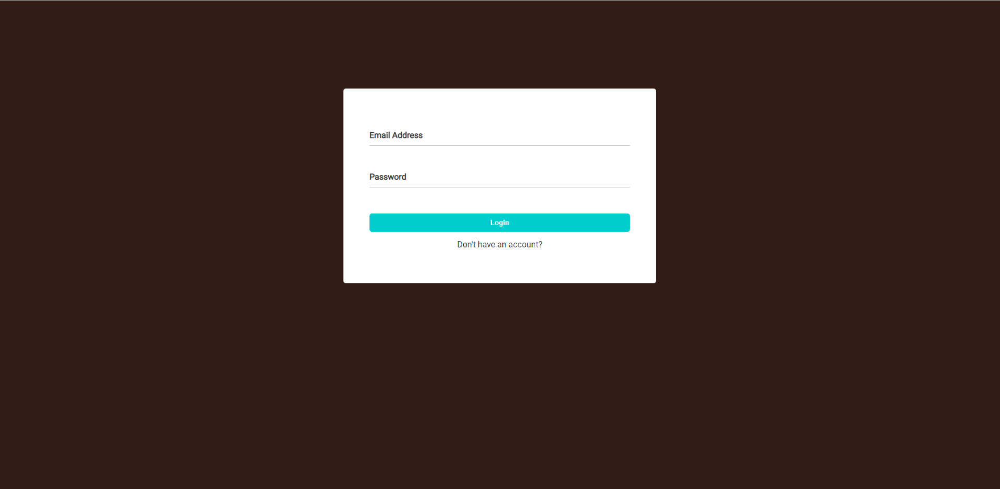
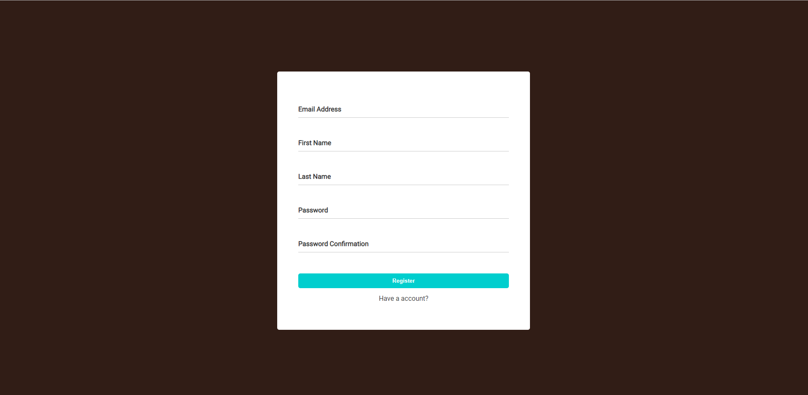
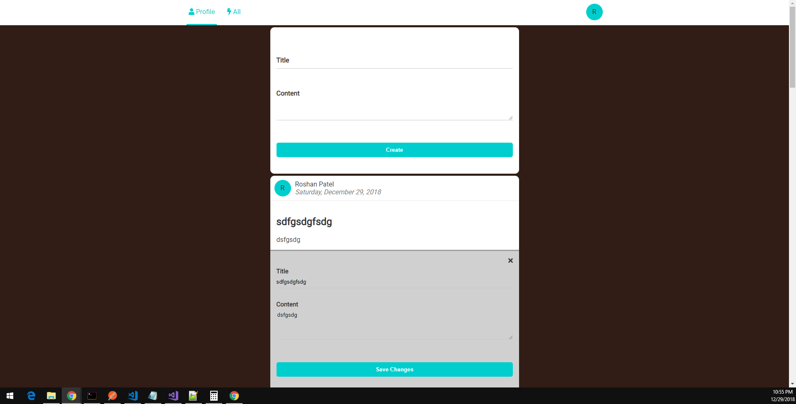
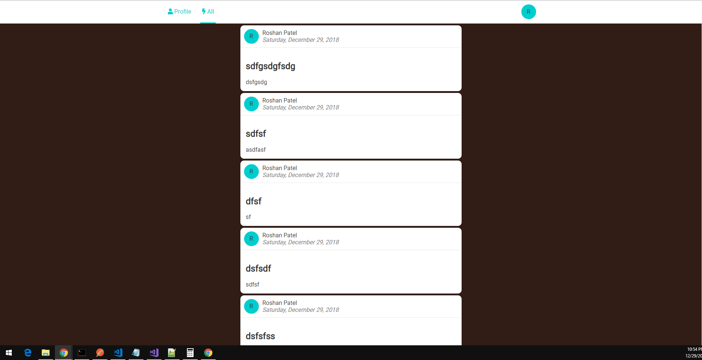

# Portal Application

## Motivation
To demonstrate frontend backend skills necessary to be a web developer at PatientCo

## Technologies Used
* Backend MVC Framework - Express
* UI Library - Vue
* Database - Postgres
* State Management - Veux
* Routing - Veux Router
* Testing - Jest

## Setup
1. Run initialize the initialization script by running `initialize.sh` from the root of the project directory.
2. Open up a terminal window and change into the server directory and type `node app.js` to run the api.
3. In another terminal window, change directory into the client directory and type `yarn serve.`
4. The application should now be fully running.

## Testing
To run tests go into the root of the client folder and type `yarn run test:unit`. Currently only frontend tests exist.

## Images

